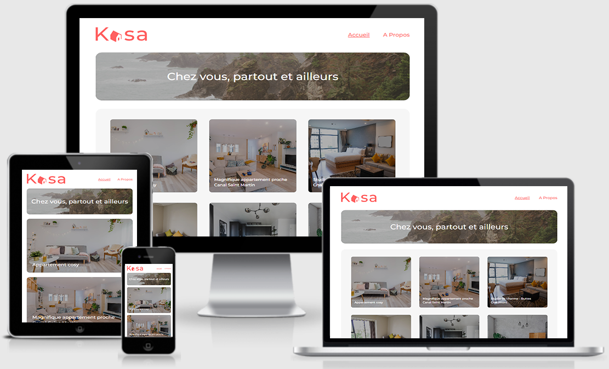

# Projet n°12 : Développer une application Web avec React et React Router

## :mag: Aperçu

## :bookmark_tabs: Sommaire

<ol>
    <li><a href="#sujet">Sujet</a></li>
    <li><a href="#demandes_respecter">Demandes à respecter</a></li>
    <li><a href="#objectifs_projet">Objectifs du projet</a></li>
    <li><a href="#technologies_utilisees">Technologies utilisées</a></li>
    <li><a href="#prerequis">Prérequis</a></li>
    <li><a href="#installation">Installation</a></li>
    <li><a href="#utilisation_siteweb">Utilisation du site web</a></li>
    <li><a href="#auteurs_contributeurs">Auteurs et contributeurs</a></li>
    <li><a href="#licence">Licence</a></li>
</ol>

## :page_facing_up: 1. Sujet 

Kasa vous recrute en tant que développeur Front-end en freelance pour développer leur nouvelle plateforme web.

Kasa est dans le métier de la location d’appartements entre particuliers depuis près de 10 ans maintenant. Avec plus de 500 annonces postées chaque jour Kasa fait partie des leaders de la location d’appartements entre particuliers en France.

L'occasion parfaite pour vous d'ajouter une belle référence à votre portfolio de freelance !

## :memo: 2. Demandes à respecter 

-   Développer l'application web en utilisant React et React Router ;
-   Respecter la maquette.

## :checkered_flag: 3. Objectifs du projet 

-   Apprendre à utiliser React et React Router.

## :computer: 4. Technologies utilisées 

-   HTML
-   CSS / Sass
-   JavaScript / React.js
-   Git & GitHub

## :exclamation: 5. Prérequis 

-   Aucun

## :wrench: 6. Installation 

-   Cloner ce repository.
-   Pour installer les différents packages, dans le terminal à partir du dossier front-end, exécuter npm install.

## :question: 7. Utilisation du site web 

-   Dans le terminal à partir du dossier front-end, exécuter npm start
-   L'application est disponible sur : http://localhost:3000/

## :beers: 8. Auteurs et Contributeurs 

Timoté Lancelle : [GitHub](https://github.com/LancelleTimote) / [LinkedIn](https://www.linkedin.com/in/timote-lancelle-devweb/)

## :page_with_curl: 9. Licence 

Distribué sous la licence MIT. Voir le fichier [LICENSE](LICENSE) pour plus d'informations.
